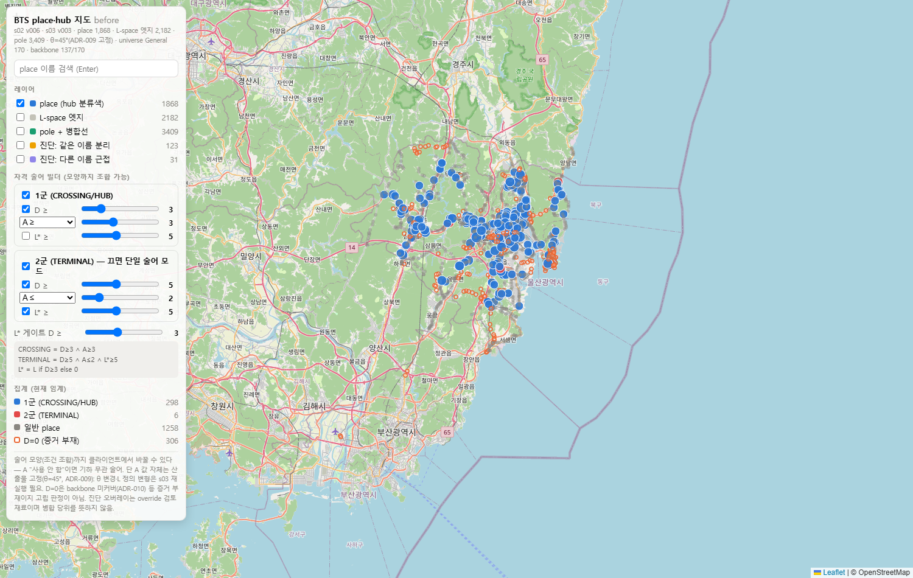

# BusToSubway — 버스망을 지하철처럼 읽기

> Giving bus data the structural layer that subway data already has.

BusToSubway는 버스 원시 데이터에 지하철 데이터가 처음부터 갖고 있는 구조를 만들어 주는 데이터 파이프라인이다.

지하철 데이터에는 보통 역, 노선, 환승역이 이미 정리되어 있다. 버스 데이터는
대개 그렇지 않다. 도로 양쪽의 정류장 표지판은 서로 다른 stop으로 흩어져 있고,
노선은 단축, 지선, 순환 변형이 섞여 있으며, 어떤 장소가 환승 거점인지는 따로
선언되어 있지 않다.

이 저장소는 울산 시내버스 원시 데이터에서 출발해 다음 세 가지 구조를 만든다.

- 정차 순서가 정리된 대표 노선 패턴
- 같은 장소로 볼 수 있는 정류장 묶음
- 노선 간 갈아타기 후보가 되는 환승 거점


*검증된 산출물을 지도에서 확인한 화면. 장소 1,868곳과 환승 거점 후보를 표시하고,
판정 기준과 병합 검토 후보를 함께 볼 수 있다. HTML 뷰어는
[`viewers/place_hub_map_before.html`](viewers/place_hub_map_before.html)에 있다
(저장소를 내려받은 뒤 브라우저에서 열면 된다).*

## 현재 산출물

| 지하철 데이터에 있는 것 | 버스 데이터에서 만든 것 | 상태 |
|---|---|---|
| 노선 | 운행 7,625건에서 정차 패턴 487개를 복원하고, 대표 정차 순서 379개를 선별 | 완료 |
| 역 | stop 3,409개를 이름과 거리 기준으로 묶어 장소(place) 1,868곳 생성 | 완료 |
| 환승역 | 장소 그래프에서 연결 수, 방향 수, 영향 지속성을 계산해 환승 거점 304곳 판정 | 완료 |
| 노선도 | 대표 노선과 장소를 바탕으로 버스망을 사람이 읽을 수 있는 지도·그래프 표현으로 정리 | 다음 단계 |
| 배차 | 노선별 시간 정보를 붙여 빈도와 기다림을 다룰 수 있게 확장 | 다음 단계 |
| 여정 계산 | 장소, 노선, 환승 거점을 연결해 실제 이동 가능성을 계산 | 다음 단계 |

## 왜 검증을 강하게 두는가

교통 데이터 파이프라인의 위험은 프로그램이 멈추는 오류보다, 그럴듯하지만 틀린
숫자를 조용히 만들어내는 데 있다. BusToSubway는 각 단계의 산출물을 다음 방식으로
검사한다.

- **구조 검증**: 행 수, 키, 참조 관계, 합계가 맞는지 확인한다. 실패하면 산출물을
  확정하지 않는다.
- **지리적 타당성 검사**: 인접 정류장 거리, 장소 병합 범위처럼 물리적으로
  이상한 값을 찾는다. 예외를 받아들이려면 명시적인 승인 기록이 필요하다.
- **변화 기록**: 산출물의 핵심 숫자가 바뀌면 조용히 덮어쓰지 않는다. 실패로
  막을 변화인지, 설명 가능한 변화인지, 새로 조사해야 하는 변화인지 기록한다.

모든 게시된 산출물에는 입력 파일 해시, 설정 해시, 코드 상태, 검증 결과가 함께
남는다. 나중에 숫자가 바뀌면 무엇이 바뀌었는지 추적할 수 있다.

## Quickstart

```bash
pip install -e ".[dev]"
python -m pytest

# 동봉된 before 산출물 재검증
PYTHONPATH=src python -m run checks --scope before

# before 파이프라인 재생산
PYTHONPATH=src python -m run all --scope before

# 지도 viewer 재생성
python tools/build_place_hub_map.py
```

## 저장소 구조

```text
docs/README.md                 공개 문서 진입점
reference/audit/*.md           원시 데이터 실측 감사 기록
src/                           로더, 생산 단계, 검증 코드
artifacts/                     검증된 산출물과 입력·검증 기록
viewers/                       산출물을 확인하는 HTML 뷰어
```

더 자세한 설명은 [docs/README.md](docs/README.md)에서 시작한다.

## 현재 범위와 한계

- 현재 공개 산출물은 개편 전(before) 울산 버스망을 대상으로 한다.
- 개편 후(after) 실운행 기록 처리 코드는 들어 있지만, 데이터 출처와 이용 조건이
  더 명확해진 뒤 공개 산출물로 확장할 계획이다.
- 환승 거점 판정은 방향 수 기준에 민감하다. 예를 들어 각도 기준 30도, 45도,
  60도에 따라 판정 수가 400, 304, 217로 달라진다. 이 차이는 숨기지 않고
  민감도표로 남긴다.
- 장소 병합은 이름과 좌표를 사용하는 보수적 규칙이다. 자동 병합이 애매한 경우는
  진단 리포트와 수동 보정 CSV로 분리한다.

## 데이터 출처

원시 데이터는 **국가교통데이터베이스(KTDB, 한국교통연구원) 공공데이터 제공
서비스**에서 신청해 받은 울산광역시 시내버스 정류장, 노선, 스케줄 데이터다
([신청 페이지](https://www.ktdb.go.kr/www/newAddPbldataReqstData.do?key=202&clTy=1)).

KTDB 저작권정책은 출처 표기를 전제로 KTDB 보유 저작물의 자유 이용을 허용한다.
본 저장소는 위와 같이 출처를 명시한다. 정류소, 노선, 경유 정류장 정보는
국토교통부 TAGO 오픈API를 통해서도 공개된 사실 정보이며, 정류장 ID 대부분이
TAGO 체계에 속한다.

`reference/variant_tagging/`은 노선 변형의 역할을 판정한 표다. 이 표는 원시
공공데이터가 아니라 본 프로젝트에서 만든 판단 데이터다.

## 라이선스

코드와 문서는 [MIT License](LICENSE)를 따른다. `data/`의 원시 데이터와 그 파생
산출물은 이 라이선스의 대상이 아니며, 위 데이터 출처 절의 이용 조건을 따른다.
